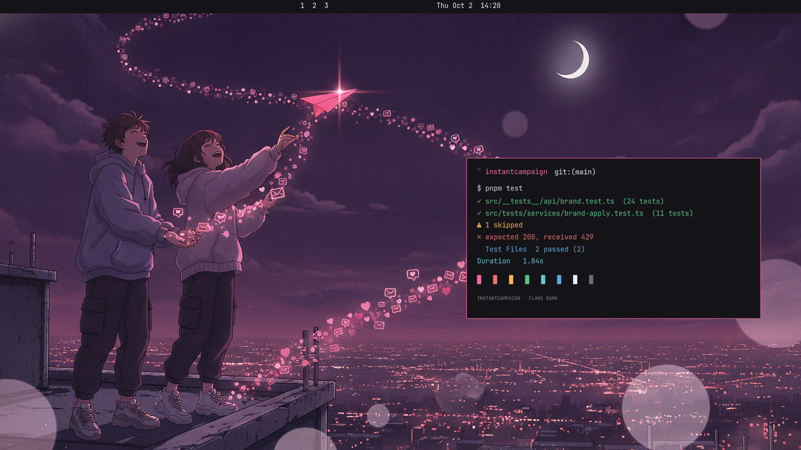

# Instant Campaign — an Omarchy theme

Raspberry on ink. The dark palette of [InstantCampaign](https://instantcampaign.ai)'s
Flare design system, with anime wallpapers of the little envelope mascot and the
people who send it.



## Install

```sh
omarchy theme install instant-campaign
```

or straight from this repository:

```sh
omarchy theme install https://github.com/Cloud-First-Consulting/omarchy-instant-campaign-theme
```

## What is in it

| | |
|---|---|
| Mode | dark |
| Background | `#141317` violet-tinted ink |
| Foreground | `#F2F0F4` |
| Accent | `#F06E9F` raspberry, lifted for contrast on dark |
| Terminal colours | the Flare semantic set: raspberry, lifted destructive red, warning amber, success green, info blue |
| Icons | Yaru-magenta-dark |
| Lock screen | the InstantCampaign wordmark |

Four 4K backgrounds, cycled with `omarchy theme bg next`:

1. **Rooftop launch** — two friends send a glowing paper-plane email into a crescent-moon sky
2. **Mascot skate** — the envelope mascot kicks a skateboard across a rooftop under a magenta moon
3. **Creator loft** — a creator at a glowing desk, holographic envelopes and open-rate charts drifting off the laptop
4. **Raspberry glow** — a plain ink field with a raspberry glow, for when you want quiet

The artwork was generated with InstantCampaign's own image tool and is covered by
the MIT license below, same as the rest of the theme.

## Credits

Palette from the Flare design tokens in InstantCampaign. Theme by
[Cloud First Consulting](https://github.com/Cloud-First-Consulting), the company
behind InstantCampaign.

## License

MIT — see [LICENSE](LICENSE).
